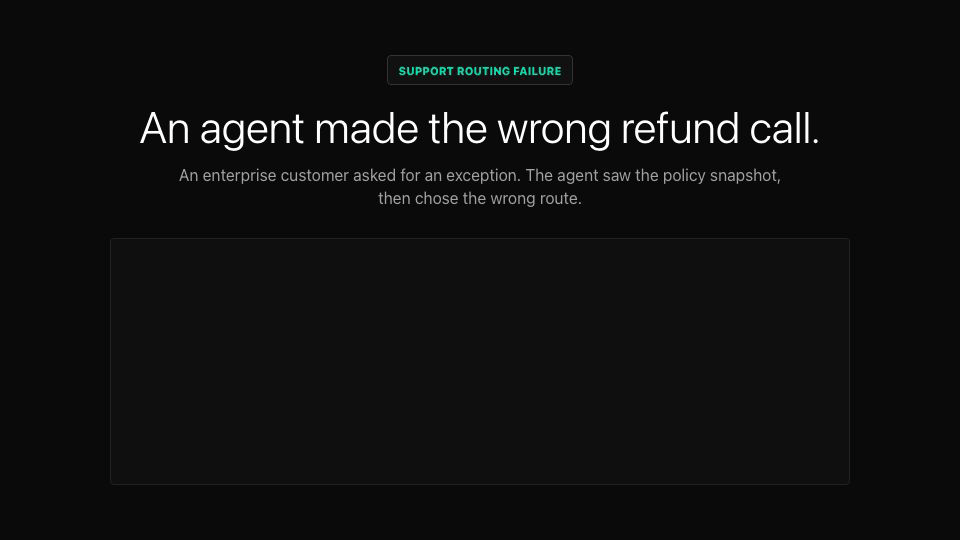

# AgentRewind

AgentRewind records, replays, inspects, and forks LLM-agent runs. It captures
the external boundaries that make agent behavior hard to debug: model calls,
tool calls, and entropy draws from time, randomness, and UUIDs.

The core invariant is simple: with the same harness code, strict replay serves
the recorded boundary outputs and makes zero live model or tool calls. If the
harness changes its trajectory, AgentRewind reports drift instead of silently
continuing.



## Install

```sh
npm install @agentrewind/sdk
```

This installs the SDK, CLI, built-in provider codecs, OpenAI client, Anthropic client, and replay test helpers. AgentRewind is ESM-only and requires Node 20 or newer.

## Skill for Coding Agents

If you use coding agents such as Claude Code, Codex, or Cursor, we highly
recommend adding the AgentRewind skill to your repository:

```sh
npx skills add faizancodes/agent-rewind
```

## Start Here

If you are adding AgentRewind to an existing agent, read
[Getting started](docs/getting-started.md) first. It explains which codec to
pick, what code belongs inside a harness, what strict replay does, and which
example to copy for your use case.

You can also ask the CLI for a provider-specific starter:

```sh
agentrewind quickstart openai
agentrewind quickstart openai-compatible
agentrewind quickstart openrouter
agentrewind quickstart anthropic
```

To create a starter file directly:

```sh
agentrewind quickstart openai --out agentrewind-openai.ts
```

## Packages

| Package | Use it for |
| --- | --- |
| `@agentrewind/sdk` | Umbrella package for normal app use. It installs the runtime, CLI, built-in provider codecs, OpenAI and Anthropic clients, and replay test helpers. |
| `@agentrewind/core` | Dependency-free runtime for record, replay, fork, session storage, redaction, and inspection helpers. |
| `@agentrewind/codec-openai` | OpenAI-compatible Chat Completions clients using `chat.completions.create()` and `chat.completions.stream()`. |
| `@agentrewind/codec-openrouter` | First-class OpenRouter Chat Completions support using the OpenAI SDK with OpenRouter defaults and attribution headers. |
| `@agentrewind/codec-anthropic` | Anthropic Messages clients using `messages.create()` and `messages.stream()`. |
| `@agentrewind/test` | Test helper for asserting a harness still follows a recorded trajectory. |
| `@agentrewind/cli` | CLI implementation used by the umbrella package. |

Most applications should import from `@agentrewind/sdk`. The smaller packages
remain published for libraries that need granular dependency boundaries.

## How It Works

Your application code runs inside a harness:

```ts
type Harness<T> = (ctx: AgentContext) => Promise<T>;
```

Inside the harness, use:

- `ctx.model.create(request, { site })` for non-streaming model calls.
- `ctx.model.stream(request, { site })` for streaming model calls.
- `ctx.tools.toolName(args)` for tool calls.
- `ctx.clock()`, `ctx.random()`, `ctx.uuid()`, and `ctx.env(key)` instead of ambient globals.
- `ctx.note(text)` for audit notes.

The `site` string is optional but strongly recommended. It gives a stable name
to a boundary call, which makes replay drift easier to diagnose and helps
disambiguate repeated requests.

Use `defineHarness()` when you want TypeScript to infer the harness return type
and, for tool-using agents, the exact `ctx.tools` names and argument/result
types.

Use `defineAgent({ tools, harness })` when an agent has tools. The returned
object carries the same tools into `recordRun()` and `replayRun()`, so you do
not have to pass the same tools object twice.

Use `assertProviderClient(model, codec)` during setup to catch provider/client
mismatches early. It verifies that the SDK client exposes the method path the
codec will wrap, such as `client.chat.completions.create(request)`. For a
stream-only smoke check, call `assertProviderClient(model, codec, ["stream"])`.
If you build a custom codec, `assertProviderCodec(codec)` validates the codec
shape before a recording starts.

Record setup validates `store`, `model`, and `codec` at runtime too, so plain
JavaScript users get a `ConfigurationError` with the missing field and a
copyable fix instead of a low-level provider call failure.

For the common case, use `AgentRewind.recordRun()` and
`AgentRewind.replayRun()`. They keep the first record/replay loop to two calls:
record one harness run, then replay that same harness run.

```ts
const recorded = await AgentRewind.recordRun(
  {
    id: "first-recording",
    store: ".rewind",
    model,
    codec
  },
  harness
);

const replayed = await AgentRewind.replayRun(recorded.path, { codec }, harness);
console.log(recorded.path, recorded.result, replayed);
```

For provider setup, prefer a preset or `withProvider()` when you can:

```ts
import { AgentRewind, createOpenAICompatibleRewind, createOpenAIRewind, defineHarness } from "@agentrewind/sdk";

const rewind = createOpenAIRewind({ store: ".rewind" });
const harness = defineHarness(async (ctx) => {
  return ctx.model.create({
    model: process.env.OPENAI_MODEL ?? "gpt-5.5",
    messages: [{ role: "user", content: "hello" }]
  });
});

const recorded = await rewind.recordRun({ id: "openai-demo" }, harness);
const replayed = await rewind.replayRun(recorded.path, harness);
```

Use `AgentRewind.record()` directly when you need lower-level control, such as
wrapping model clients manually, adding notes between runs, or packing from the
session object. Use `AgentRewind.replay()` directly when you need inspection
APIs or `replay.fork()`. Loading a replay without `{ codec }` is fine for
inspection methods such as `events()` and `contextAt()`, but `run()` and
`fork()` need the same provider codec used during recording.

## Quickstart: OpenAI-Compatible Chat Completions

Use this path for OpenAI and providers that work through the OpenAI Node SDK
with a custom `baseURL`.

```ts
import { createOpenAIRewind, defineHarness } from "@agentrewind/sdk";
import type { ChatCompletion, ChatCompletionChunk } from "@agentrewind/sdk";

const chatModel = process.env.OPENAI_MODEL ?? "gpt-5.5";
const rewind = createOpenAIRewind({ store: ".rewind" });

const harness = defineHarness(async (ctx) => {
  const response = await ctx.model.create<ChatCompletion>(
    {
      model: chatModel,
      messages: [
        { role: "system", content: "Answer tersely." },
        { role: "user", content: `Request ${ctx.uuid()}` }
      ],
      temperature: 0
    },
    { site: "answer-question" }
  );

  return response.choices[0]?.message.content ?? "";
});

const recorded = await rewind.recordRun({ id: "openai-demo" }, harness);

const replayedAnswer = await rewind.replayRun(recorded.path, harness);
```

After a session exists, replay APIs can resolve common selectors too:

```ts
const sessions = await AgentRewind.listSessions(".rewind");
const summaries = await AgentRewind.listSessionSummaries(".rewind");
const latestPath = await AgentRewind.resolveSessionPath("latest", { store: ".rewind" });
const summary = await AgentRewind.summary("latest", { store: ".rewind" });
const timeline = await AgentRewind.timeline("latest", { store: ".rewind" });
const prompt = await AgentRewind.promptContext("latest", {
  store: ".rewind",
  site: "answer-question"
});
const tool = await AgentRewind.toolCall("latest", {
  store: ".rewind",
  name: "lookupCustomer"
});
const entropy = await AgentRewind.entropyDraw("latest", {
  store: ".rewind",
  source: "uuid"
});
await AgentRewind.pack("latest", "latest-session.rewind", { store: ".rewind" });

const replayedLatest = await AgentRewind.replayRun(
  "latest",
  { store: ".rewind", codec: rewind.codec },
  harness
);
```

For an OpenAI-compatible provider:

```ts
const rewind = createOpenAICompatibleRewind({
  baseURL: "https://your-provider.example/v1"
});
```

Streaming uses the OpenAI SDK chat completion stream helper:

```ts
const streamSession = rewind.record({ id: "stream-demo" });

await streamSession.run(async (ctx) => {
  for await (const chunk of ctx.model.stream<ChatCompletionChunk>(
    {
      model: chatModel,
      messages: [{ role: "user", content: "Stream one sentence." }]
    },
    { site: "stream-answer" }
  )) {
    process.stdout.write(chunk.choices[0]?.delta?.content ?? "");
  }
});
await streamSession.close();
```

The OpenAI codec expects the client to expose
`chat.completions.create()` for non-streaming calls and
`chat.completions.stream()` for streaming calls.

## Quickstart: OpenRouter

OpenRouter uses the OpenAI SDK with a different base URL. AgentRewind exposes
first-class OpenRouter helpers from the SDK so OpenRouter sessions have their
own provider identity and client setup defaults.

```ts
import {
  AgentRewind,
  OpenAI,
  assertProviderClient,
  defineHarness,
  openRouterChatCodec,
  openRouterClientOptions
} from "@agentrewind/sdk";
import type { ChatCompletion } from "@agentrewind/sdk";

const model = new OpenAI(
  openRouterClientOptions({
    apiKey: process.env.OPENROUTER_API_KEY,
    appUrl: "https://your-app.example",
    appTitle: "Your Agent"
  })
);
const openRouterModel = process.env.OPENROUTER_MODEL ?? "openrouter/model-id";

const codec = openRouterChatCodec();
assertProviderClient(model, codec);

const harness = defineHarness(async (ctx) => {
  const response = await ctx.model.create<ChatCompletion>(
    {
      model: openRouterModel,
      messages: [{ role: "user", content: `Request ${ctx.uuid()}` }],
      temperature: 0,
      provider: {
        allow_fallbacks: true
      }
    },
    { site: "openrouter-answer" }
  );

  return response.choices[0]?.message.content ?? "";
});

const recorded = await AgentRewind.recordRun(
  {
    id: "openrouter-demo",
    store: ".rewind",
    model,
    codec
  },
  harness
);

const replayed = await AgentRewind.replayRun(recorded.path, { codec }, harness);
```

## Quickstart: Anthropic Messages

```ts
import { AgentRewind, Anthropic, anthropicCodec, assertProviderClient, defineHarness } from "@agentrewind/sdk";
import type { AnthropicMessage } from "@agentrewind/sdk";

const model = new Anthropic({
  apiKey: process.env.ANTHROPIC_API_KEY
});
const anthropicModel = process.env.ANTHROPIC_MODEL ?? "claude-opus-4-8";

const codec = anthropicCodec();
assertProviderClient(model, codec);

const harness = defineHarness(async (ctx) => {
  const message = await ctx.model.create<AnthropicMessage>(
    {
      model: anthropicModel,
      max_tokens: 256,
      system: "Answer with operational detail.",
      messages: [{ role: "user", content: `Request ${ctx.uuid()}` }]
    },
    { site: "draft-answer" }
  );

  return message.content;
});

const recorded = await AgentRewind.recordRun(
  {
    id: "anthropic-demo",
    store: ".rewind",
    model,
    codec
  },
  harness
);

const replayed = await AgentRewind.replayRun(recorded.path, { codec }, harness);
```

The Anthropic codec expects `messages.create()` for non-streaming calls and
`messages.stream()` for streaming calls.

## Tools

Tool handlers are regular async functions or async iterables. Record mode runs
the live handler and stores the result. Strict replay serves the recorded result
without calling the handler again.

```ts
import { defineHarness, defineTools } from "@agentrewind/sdk";

const tools = defineTools({
  lookupCustomer: async (args: { customerId: string }) => {
    return crm.customers.get(args.customerId);
  }
});

const chatModel = process.env.OPENAI_MODEL ?? "gpt-5.5";

const harness = defineHarness(tools, async (ctx) => {
  const customer = await ctx.tools.lookupCustomer({ customerId: "cus_123" });
  return ctx.model.create(
    {
      model: chatModel,
      messages: [{ role: "user", content: JSON.stringify(customer) }]
    },
    { site: "summarize-customer" }
  );
});

await AgentRewind.recordRun(
  {
    id: "tools-demo",
    store: ".rewind",
    model,
    codec,
    tools
  },
  harness
);
```

`defineHarness(tools, ...)` keeps TypeScript aware of which tools exist and what
each tool accepts/returns, so engineers do not have to write
`Harness<Result, typeof tools>` by hand. `defineAgent({ tools, harness })` keeps
those tools attached at runtime too. Tool arguments and results must be
JSON-serializable unless you provide a tool serializer.

JSON-serializable means `null`, strings, finite numbers, booleans, arrays, and
plain objects. Convert `Date`, `Map`, class instances, `Buffer`, `BigInt`,
`NaN`, and functions before returning them from tools. If your application needs
those values at runtime, pass `toolSerializers` with `serialize()` and
`deserialize()` functions for that tool.

If you do not use `defineAgent()`, pass the same `tools` object to
`defineHarness(tools, harness)` and `AgentRewind.record()` or
`AgentRewind.recordRun()`. If a harness calls `ctx.tools.someTool()` during
recording and that handler was not configured, AgentRewind throws a
`ConfigurationError` that lists the configured tools and the missing tool name.

## Typing Model Responses

`ctx.model` is provider-neutral, so response types are opt-in at the call site.
Pass the SDK response type as a generic when you want typed fields:

```ts
import type { ChatCompletion } from "@agentrewind/sdk";

const completion = await ctx.model.create<ChatCompletion>(request, {
  site: "typed-openai-call"
});

completion.choices[0]?.message.content;
```

## Replay Drift

Strict replay fails when the harness no longer matches the recording:

```ts
await AgentRewind.replayRun(".rewind/openai-demo", {
  codec,
  driftPolicy: "strict"
}, harness);
```

Useful replay modes:

- `strict`: fail on the first model, tool, or entropy drift. This is the
  default and makes no live calls.
- `warn`: print drift diagnostics, then fail.
- `passthrough`: call the live model or tool on drift. Use this when you are
  intentionally exploring outside the recorded path.

For readable test output and app logs, format AgentRewind errors with
`explainRewindError()`:

```ts
import { AgentRewind, explainRewindError } from "@agentrewind/sdk";

try {
  await AgentRewind.replayRun(".rewind/openai-demo", { codec }, harness);
} catch (error) {
  console.error(explainRewindError(error, {
    sessionPath: ".rewind/openai-demo"
  }));
  throw error;
}
```

The explanation includes expected vs actual boundary details, common fixes, and
useful CLI commands such as `agentrewind doctor` and `agentrewind inspect`.
When the failing boundary is a named model call, it suggests
`agentrewind context <session> --site <name>` so you can inspect the prompt
without translating the site back to a step number first.

## Inspecting Sessions

Programmatic inspection:

```ts
const replay = await AgentRewind.replay(".rewind/openai-demo", { codec });
const events = replay.events();
const context = await AgentRewind.promptContext(".rewind/openai-demo", {
  site: "answer-question"
});
```

You can pass the same selectors supported by the CLI:

```ts
await AgentRewind.replay("openai-demo", { store: ".rewind" });
await AgentRewind.replay("latest", { store: ".rewind" });
```

For a lightweight report without loading a replay object:

```ts
const summary = await AgentRewind.summary("latest", { store: ".rewind" });
const timeline = await AgentRewind.timeline("latest", { store: ".rewind" });
console.log(summary.provider, summary.counts.modelCalls, summary.usage.inputTokens);
```

Use `timeline` when a test or dashboard needs the same compact rows as
`agentrewind inspect --json`. To inspect prompts directly by stable `site` name:

```ts
const prompt = await AgentRewind.promptContext("latest", {
  store: ".rewind",
  site: "answer-question"
});
const diff = await AgentRewind.promptDiff("latest", {
  store: ".rewind",
  fromSite: "draft-answer",
  toSite: "final-answer"
});
const tool = await AgentRewind.toolCall("latest", {
  store: ".rewind",
  name: "lookupCustomer"
});
const entropy = await AgentRewind.entropyDraw("latest", {
  store: ".rewind",
  source: "uuid"
});
await AgentRewind.pack("latest", "latest-session.rewind", { store: ".rewind" });
```

For inspection only, the codec can be omitted:

```ts
const replay = await AgentRewind.replay(".rewind/openai-demo");
console.log(replay.events());
```

Pass `{ codec }` before calling `replay.run()` or `replay.fork()` so
AgentRewind can fingerprint current requests and denormalize live fork tails.

CLI inspection:

```sh
agentrewind quickstart openai
agentrewind quickstart openai --format ts
agentrewind quickstart openai --out agentrewind-openai.ts
agentrewind list .rewind
agentrewind list .rewind --json
agentrewind doctor .rewind/openai-demo
agentrewind doctor openai-demo --store .rewind
agentrewind doctor latest --store .rewind
agentrewind inspect .rewind/openai-demo
agentrewind timeline .rewind/openai-demo --kind model_call --site answer-question
agentrewind inspect .rewind/openai-demo --json
agentrewind context .rewind/openai-demo
agentrewind prompt .rewind/openai-demo --site answer-question
agentrewind fork .rewind/openai-demo --site answer-question --system "Prefer policy-backed answers."
agentrewind search .rewind/openai-demo --site answer-question --candidate "Escalate::Prefer policy-backed escalation." --candidate "Hold::Ask for more context." --goal-contains "escalate"
agentrewind entropy .rewind/openai-demo --source uuid
agentrewind pack .rewind/openai-demo openai-demo.rewind
agentrewind unpack openai-demo.rewind unpacked-demo
```

`pack` excludes the local vault used to restore redacted secrets, so packed
sessions can be shared without including the original secret values.

Use `list` when you know the store directory but do not remember the exact
session id. It prints each session path plus provider, origin, boundary counts,
and token usage, so the next `doctor`, `inspect`, `context`, or `diff` command
can copy the right `.rewind/<session-id>` path.

Single-session commands also accept easier selectors. Use a full session path,
a session id with `--store .rewind`, `latest --store .rewind`, or the store
directory itself when it contains exactly one session.

`inspect` prints a labeled timeline table by default. `timeline` is an alias.
Use `--kind`, `--site`, `--errors`, `--live`, `--from`, and `--to` to filter
large sessions. Use `--json` when a test or script needs stable
machine-readable fields, or `--no-header` when you want compact TSV output.

`context` defaults to the first model call and prints a readable prompt view.
`prompt` is an alias. Add `--json` for the raw message array. `diff` defaults to the first two
model calls. Use `--site`, `--from-site`, and `--to-site` when you know the
stable site names from your harness. Use explicit step flags after `inspect`
when a site appears more than once or you need an exact recorded step.

`tool` prints a readable tool-call view by default. Add `--json` for recorded
args, result, error, stream chunks, latency, and provenance as JSON. Use
`--name` when the tool appears once, or `--step` after `inspect` when a tool
appears multiple times.

`entropy` prints recorded `ctx.clock()`, `ctx.random()`, or `ctx.uuid()` values
as JSON. Use `--source` when that source appears once, or `--step` after
`inspect` when the same source appears multiple times.

`fork` starts from a recorded model call, reuses the recorded prefix, and sends
the tail to a live provider client. Pick the model call with `--site` or
`--step`, then change the live tail with `--system` and/or `--model`:

```sh
agentrewind fork latest \
  --store .rewind \
  --site answer-question \
  --system "Prefer concise, policy-backed answers." \
  --model gpt-5.5
```

Provider credentials are read from environment variables: `OPENAI_API_KEY`,
`OPENROUTER_API_KEY`, `ANTHROPIC_API_KEY`, or `COMPATIBLE_API_KEY` plus
`COMPATIBLE_BASE_URL` for generic OpenAI-compatible endpoints. Use
`--provider openrouter`, `--provider anthropic`, or `--provider openai-compatible`
when auto-detection is not specific enough. Add `--dry-run` to verify the fork
point and provider setup without spending tokens.

Successful forks write a normal child session next to the parent. The child
contains the recorded prefix boundaries with `provenance: "recorded"` and the
new tail boundaries with `provenance: "live"` or `provenance: "stub"`, so
`agentrewind inspect <child>` shows the complete forked trajectory.

`search` runs multiple fork rollouts from the same model-call step and ranks
them. Use repeated `--candidate "label::system prompt"` flags for quick prompt
sweeps, or `--actions candidates.json` for structured `{ id, label, system,
model, prior }` candidates. The built-in CLI scorer is intentionally simple:
`--goal-contains <text>` gives a rollout score of `1` when the live model output
contains that text. Use `--strategy beam` for deterministic candidate sweeps or
`--strategy monte-carlo`, `ucb`, `mcts`, or `alpha-zero` when you need sampled,
bandit, or tree-search rollouts.

## Forking

Forking replays the prefix of a session and sends the tail live. Use it to test
prompt/model overrides from a known decision point.

For the common provider-backed workflow, use the CLI:

```sh
agentrewind inspect .rewind/openai-demo
agentrewind fork .rewind/openai-demo \
  --site answer-question \
  --system "Prefer concise, policy-backed answers." \
  --model gpt-5.5
agentrewind inspect .rewind/<child-session-id>
```

The command writes a child session next to the parent and prints follow-up
`inspect` / `context` commands. The child is replayable like any other session:
prefix tool/model/entropy boundaries are served from the parent recording, and
only the forked tail represents new live work. Use the SDK API when the fork
needs your current harness code, a custom goal predicate, or custom tool policy:

```ts
const replay = await AgentRewind.replay(".rewind/openai-demo", { codec });

const fork = await replay.fork({
  atStep: 0,
  harness,
  model,
  overrides: {
    system: "Prefer concise, policy-backed answers.",
    model: process.env.OPENAI_MODEL ?? "gpt-5.5"
  },
  goal: (trace) => {
    return trace.events().some((event) => event.kind === "tool_call" && event.name === "sendEmail");
  }
});

console.log(fork.reachedGoal, fork.tokensSpent);
```

`atStep` uses the same boundary-event step numbers returned by `events()` and
shown by `agentrewind inspect`. When a step lands inside concurrent work,
splitting is best-effort because concurrent lanes are only partially ordered.
Pass `harness` when you want the fork to execute your current agent code. If
omitted, fork reuses the last harness passed to `replay.run()`, or falls back to
walking stored events for simple live-tail experiments.

Fork child sessions persist both sides of the split. That means a child created
from a model step after a tool call can be strictly replayed with a full
matching harness: the prefix tool call is served from the child recording, then
the forked model result is served from the child recording. If the fork changed
the prompt or model request, replay the child with the updated harness code that
now builds that request. `fork.tokensSpent` only counts live tail model calls
made while creating the fork.

Provider-specific fork coverage lives in the codec packages. The deterministic
suite verifies OpenAI Chat Completions, Anthropic Messages, and OpenRouter Chat
Completions fork tails against SDK-shaped clients:

```sh
pnpm test:provider-forks
```

To smoke test against live provider APIs, export the relevant API keys and model
ids, then run `pnpm test:live:provider-forks`. The live suite is opt-in and
skips providers whose key/model variables are not present.

## Trajectory Search

Trajectory search automates repeated forks from one recorded decision point.
Use it when a bad agent run has a clear goal, but you want to compare several
prompt/model/tool-policy candidates without rerunning the recorded prefix.

The CLI path is useful for provider-backed prompt sweeps:

```sh
agentrewind search .rewind/support-router \
  --site refund-routing-decision \
  --provider openrouter \
  --model openai/gpt-4o-mini \
  --candidate "Escalate::Enterprise refund exceptions should escalate-to-csm." \
  --candidate "Hold::Ask the customer to wait for policy review." \
  --goal-contains "escalate-to-csm" \
  --strategy beam
```

CLI search can also score with `--goal-regex`, `--goal-json path=value`,
`--goal-tool <name>`, or `--scorer ./score.mjs` for custom scoring such as
LLM-as-a-judge.

The SDK path gives you helpers for common searches plus access to each child
trace when you need custom scoring:

```ts
import { AgentRewind, search } from "@agentrewind/sdk";

const replay = await AgentRewind.replay(".rewind/support-router", { codec, model });
await replay.run(harness);

const result = await search.promptSweep(replay, {
  atStep: 2,
  harness,
  model,
  prompts: [
    { id: "hold", label: "Hold", system: "Ask for more context." },
    { id: "escalate", label: "Escalate", system: "Enterprise exceptions escalate-to-csm." }
  ],
  strategy: "beam",
  concurrency: 2,
  bestBranchBy: "mean",
  budget: { maxRollouts: 3, stopScore: 1 },
  score: ({ result, trace }) => ({
    score: String(result).includes("escalate-to-csm") ? 1 : 0,
    reason: `events=${trace.events().length}`
  })
});

console.log(result.best?.action?.id, result.best?.score, result.best?.sessionPath);
console.log(result.bestBranch?.meanScore, result.searchPath);
```

Each rollout writes a normal fork child session, and search writes a manifest
under `<store>/searches/` with node scores, reasons, errors, diagnostics, and
best-child metadata. Inspect the report later with:

```sh
agentrewind search report <search-id>
agentrewind search promote <winning-child> --out tests/fixtures/support-router.regression.json
```

Use `search.modelSweep()` to compare model IDs, `search.regression()` to score
assertions, or `search.judge()` with `search.defineJudgeRubric()` for
LLM-as-a-judge scoring with redaction, caching, structured output, and separate
judge token/cost reporting. If an action changes the prompt or model request,
replay the winning child with the updated harness code that now builds that
request. See `examples/trajectory-search-prompt-sweep/index.mjs` for a complete
runnable prompt-sweep example. For detailed scoring patterns, including parsed
JSON, tool-call scoring, cost-adjusted scoring, multi-objective scoring, and
LLM-as-a-judge natural-language metrics, read
[Trajectory search scoring strategies](docs/trajectory-scoring.md). For
detailed search mechanics, including beam search, Monte Carlo search,
UCB, MCTS, AlphaZero-style PUCT, multi-depth action sequences, budgets, priors,
and dynamic action generation, read
[Trajectory search strategy guide](docs/trajectory-search-strategies.md).

## Redaction

Redaction is enabled by default. AgentRewind redacts common API-key and bearer
token shapes, plus environment variable values whose names look secret. You can
add patterns:

```ts
const session = AgentRewind.record({
  id: "redaction-demo",
  store: ".rewind",
  model,
  codec,
  redaction: {
    enabled: true,
    patterns: [/customer-secret-[a-z0-9]+/gi]
  }
});
```

During local replay, the vault restores redacted values before returning
recorded responses and tool results to the harness. Packed `.rewind` bundles do
not include the vault.

## Testing

Use the SDK test helpers to turn a recorded session into a replay regression
test. The shortest form is one assertion:

```ts
import { openaiChatCodec } from "@agentrewind/sdk";
import { assertReplay } from "@agentrewind/sdk/testing";

await assertReplay("latest", { store: ".rewind", codec: openaiChatCodec() }, async (ctx) => {
  await ctx.model.create(
    {
      model: process.env.OPENAI_MODEL ?? "gpt-5.5",
      messages: [{ role: "user", content: `Request ${ctx.uuid()}` }]
    },
    { site: "answer-question" }
  );
});
```

Use `fromSession()` when a test needs to inspect events before asserting:

```ts
import { fromSession } from "@agentrewind/sdk/testing";

const session = await fromSession("openai-demo", {
  store: ".rewind",
  codec: openaiChatCodec()
});

expect(session.replay.events().some((event) => event.kind === "model_call")).toBe(true);
await session.assertReplay(harness);
```

Test helpers accept the same session selectors as replay: a full path, a session
id with `{ store }`, `latest` with `{ store }`, or a store directory containing
one session. When drift occurs, `assertReplay()` throws a Node `AssertionError`
whose message already includes the same human-readable explanation.

## Runnable Examples

The `examples/` directory contains API-key-free examples written as practical
agent workflows. They use fake clients with real SDK-shaped method paths, so the
record/replay behavior is real even though no network calls are made:

- `examples/sample-agent`: debug a bad incident-routing decision, inspect the
  captured prompt, and fork a corrected prompt from the exact bad model step.
- `examples/fork-replay-prompt-fix`: fork a replay from a recorded model step,
  reuse the historical tool/entropy prefix, and test a prompt fix on the live
  tail.
- `examples/openai-compatible-support-bot`: replay a SaaS support triage agent
  that calls account/incident tools, uses an OpenAI-compatible model, and
  verifies redaction on disk.
- `examples/openai-compatible-streaming`: record and replay a streamed status
  page update exactly as a UI or CLI would consume live chunks.
- `examples/openrouter-support-router`: preserve and replay OpenRouter provider
  routing options, plugins, and JSON response format through the first-class
  OpenRouter codec.
- `examples/anthropic-tool-agent`: replay an Anthropic support-reply agent
  without duplicating CRM/escalation side effects.

Run them with:

```sh
pnpm build
pnpm examples:run
```

## Further Guides

- [Getting started](docs/getting-started.md): provider choice, first recording,
  first replay, CLI inspection, and common mistakes.
- [Provider codecs](docs/provider-codecs.md): supported SDK shapes and the
  contract for custom codecs.
- [Operational guide](docs/operational-guide.md): call-site naming, replay
  drift, redaction, packing, and CI patterns.

## Development

```sh
pnpm install
pnpm typecheck
pnpm test
pnpm build
pnpm examples:run
pnpm check
```

`@agentrewind/core` has no runtime package dependencies. The SDK and CLI include
the built-in provider codecs and provider SDK clients needed for the one-install
workflow.

## Current Boundaries

AgentRewind wraps SDK method paths through provider codecs. It does not perform
transport-level `fetch` or `node:http` interception. Harness code should route
model calls, tools, and entropy through `ctx`; other I/O will execute again
during replay unless you model it as a tool.
